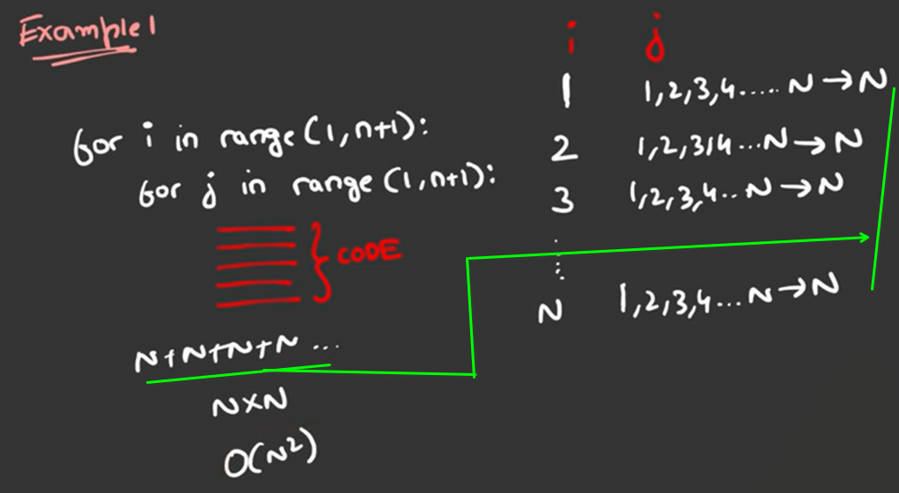

**Time complexity**: rate of increase in time with respect to input size

**rules to calculate time complexity**:
- Always calculate TC in terms of worst case `TC = testcase`
- avoid the constant values
- Avoid lower bound

**Space complexity**: 
- **Auxillary space**: the extra space used to solve the problem
- **input space**: space used for storing the input

**Python Time complexity:** https://wiki.python.org/moin/TimeComplexity

example1 
