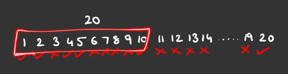

# Print factors/ divisors

10 -> [1, 2, 5, 10]

15 -> [1, 3, 5, 15]

25 -> [1, 5, 25]

7 -> [1, 7]

19 -> [1, 19]

## approach one

lets take a example 20



- from the above pic, loop till 10 (20/2), also figure out in loop which is factor

> from this we could have saved N/2 time complexity, where N is the input number

## approach two

lets take example 36

- lets start from 1, 36%1 == 0, and 36/1 = 36

> from the above step we got factors = 1, 36

- for 2, 36%2 == 0 and 36/2 = 18

> from the avove step we got factors = 2, 18

- for 3, 36%3 == 0 and 36/3 = 12

> from the avove step we got factors = 3, 12

- for 4, 36%4 == 0 and 36/4 = 9

> from the avove step we got factors = 4, 9

- for 5, wont happen

- for 6, 36%6 == 0 and 36/6 = 6

> from the avove step we got factors = 6

```
here loop will continue till the end of square root of num, after that break the loop

that is sqrt(36) = 6
```
