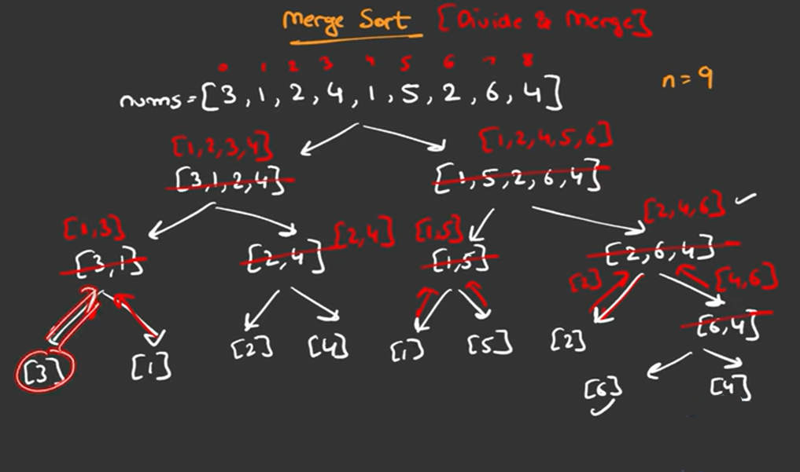

# Merge Sort

from the below pic, the last element is already sorted

whole algorithm runs in o(n log n) in time ( time complexity)
space complexity o(n) where n is the length of array

- first merge the array ( because its easy )
- then do code for merge sort recursively, here base case is if arr length is one, then return that single itemed arr