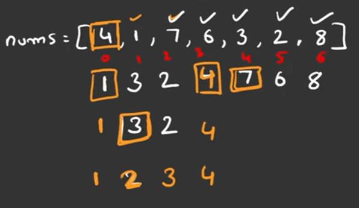
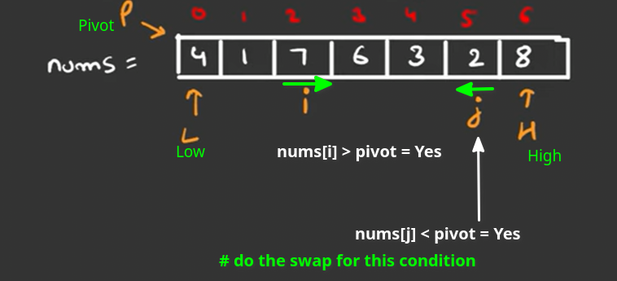
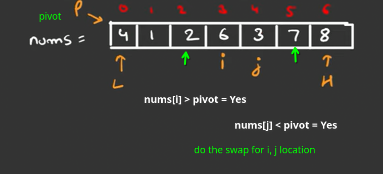
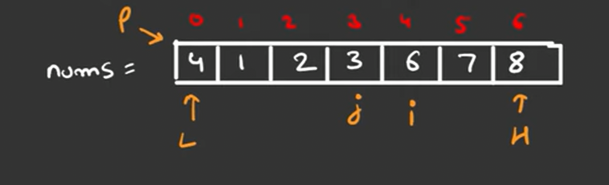
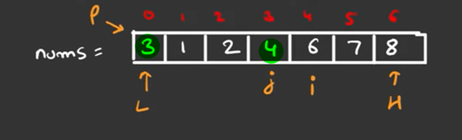

# QuickSort

explanation:


how to pick a pivot



from the above pic, its clear that, there is some kind of recursion

> from the below pic, i starts from Low, j starts from high




as soon as you reach the above condition, swap the elements

continue from above:



from the  below pic is i and j are overlapping so, swap i-1 value with pivot





from the above, position of `j` already set

---

from the code,

``` py
    while i< j:
        while nums[i] <= pivot and i < high: 
            i+=1
        while nums[j] >= pivot and j > low:
            j -= 1
```

>
> `i < high` , this edge case is required to terminate the loop
>
> for example: if arr = [3, 2, 1], pivot = 3, low = 0 , high = 2, loop will continue till high 
>
> vice versa applies to `j > low`